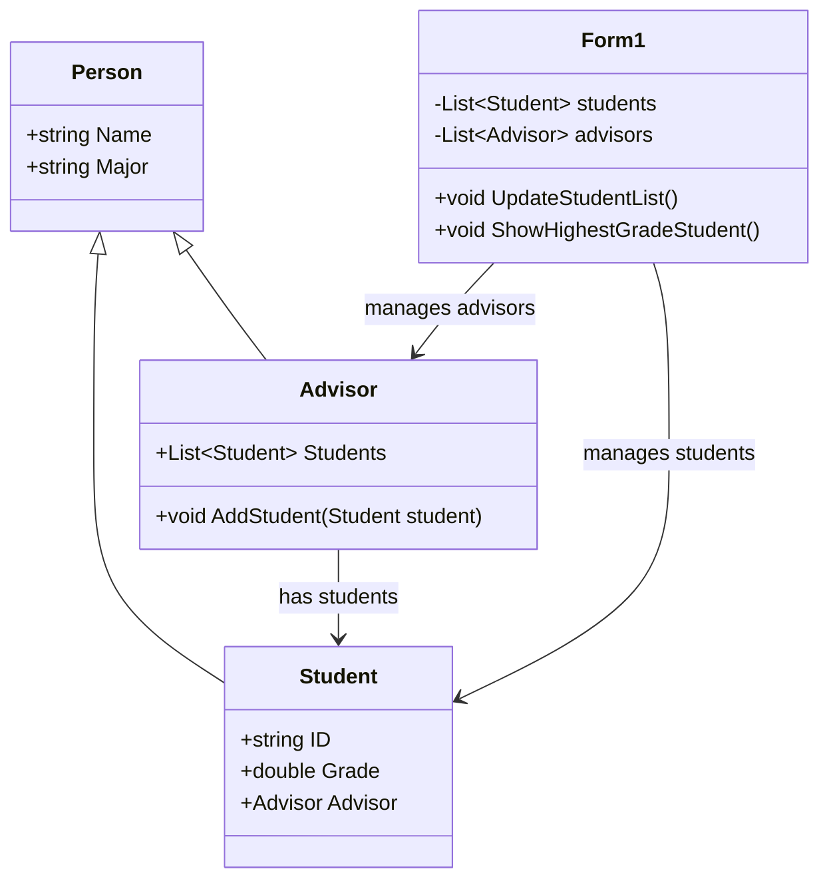

<h1 align="center">Welcome to My Project</h1>
By นายปลวัชร สุทธมา 673450473-2

```

โปรแกรมนี้ใช้ 4 หลักการเขียนโปรแกรมเชิงวัตถุ ดังนี้

1. Encapsulation (การห่อหุ้มข้อมูล):

•	คลาส Student, Advisor, และ Person มีการกำหนดคุณสมบัติ (properties) และเมธอด (methods) ที่เกี่ยวข้องกับตัวเอง ซึ่งช่วยในการจัดการข้อมูลและพฤติกรรมของวัตถุแต่ละตัว
•	การเข้าถึงข้อมูลภายในคลาสทำได้ผ่านเมธอดและคุณสมบัติที่กำหนดไว้เท่านั้น เช่น การเพิ่มนักศึกษาในคลาส Advisor ผ่านเมธอด AddStudent

2. Inheritance (การสืบทอด):

•	คลาส Student และ Advisor สืบทอดคุณสมบัติและพฤติกรรมจากคลาส Person ซึ่งช่วยลดการเขียนโค้ดซ้ำซ้อนและเพิ่มความสามารถในการขยายโปรแกรม
•	คลาส Person มีคุณสมบัติ Name และ Major ที่ถูกสืบทอดไปยังคลาส Student และ Advisor

3. Polymorphism (พหุสัณฐาน):

•	การใช้พหุสัณฐานในโปรแกรมนี้อาจไม่ชัดเจนมากนัก แต่สามารถเห็นได้จากการที่คลาส Student และ Advisor สามารถถูกใช้งานในลักษณะของคลาส Person ได้ เนื่องจากเป็นการสืบทอดจากคลาส Person

4. Abstraction (การนามธรรม):

•	คลาส Person เป็นคลาสนามธรรมที่รวบรวมคุณสมบัติพื้นฐานที่ใช้ร่วมกันระหว่างคลาส Student และ Advisor ซึ่งช่วยในการจัดการและขยายโปรแกรมได้ง่ายขึ้น

```

<h1 align="center">Class Diagram</h1>


